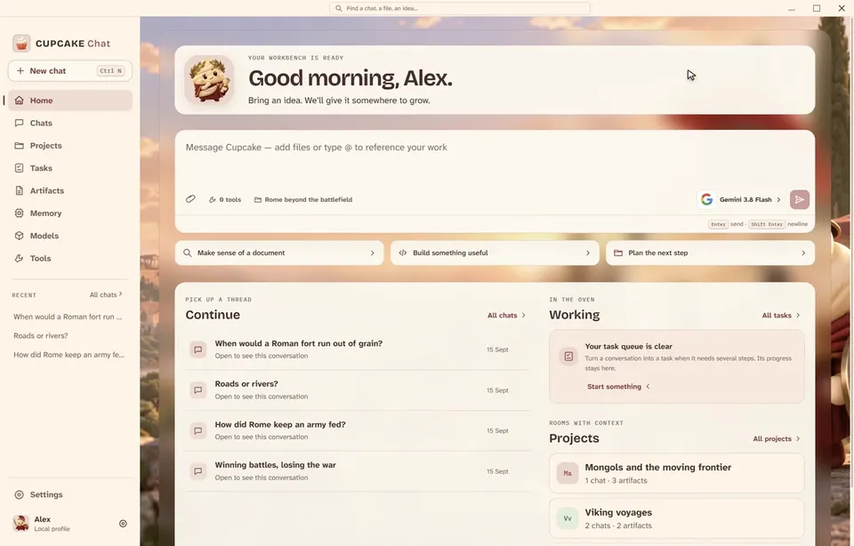

<p align="center">
  
</p>

<p align="center">
  <a href="https://github.com/AkshitIreddy/cupcake-chat/releases/latest"></a>
  <a href="https://github.com/AkshitIreddy/cupcake-chat/releases/latest"></a>
  <a href="#free-ways-to-start"></a>
  <a href="#what-cupcake-chat-is-good-at"></a>
  <a href="LICENSE"></a>
</p>

<h1 align="center">Cupcake Chat</h1>

<p align="center">
  <strong>A little curiosity. A whole team of possibilities.</strong><br />
  Chat with your favorite models, gather a team of Cupcake advisors,<br />
  and turn questions into ideas, working code, and projects worth keeping.
</p>

<p align="center">
  <a href="#install-and-finish-setup"><strong>▸ Get started</strong></a>
  &nbsp;·&nbsp;
  <a href="#see-it-in-action"><strong>▸ See it in action</strong></a>
  &nbsp;·&nbsp;
  <a href="#free-ways-to-start"><strong>▸ Free model options</strong></a>
  &nbsp;·&nbsp;
  <a href="https://github.com/AkshitIreddy/cupcake-chat/releases/latest"><strong>▸ What's new</strong></a>
  &nbsp;·&nbsp;
  <a href="#for-developers-and-ai-contributors"><strong>▸ For developers</strong></a>
</p>

<a id="see-it-in-action"></a>

<p align="center">
  
</p>

<p align="center"><sub>Demo built with <a href="https://www.npmjs.com/package/gifsmith">Gifsmith</a></sub></p>

---

## For users

### What Cupcake Chat is good at

Cupcake Chat is designed for the ordinary problems that usually spread across several tabs and
half-finished notes: planning a trip, understanding a bill, comparing choices, learning a difficult
topic, cleaning a spreadsheet, drafting a message, or turning an answer into a file you can keep.

- **One chat, many model choices.** Connect Groq, Gemini, Mistral, Cohere, NVIDIA NIM, OpenRouter,
  Cloudflare Workers AI, OpenAI, Anthropic, xAI, or a compatible endpoint. The selected route is
  explicit, and switching models does not silently reroute a request.
- **Optional local AI.** Cupcake Local detects the computer, recommends compatible models, manages
  the runtime and downloads, and can run supported GGUF models on CPU, NVIDIA CUDA, or Vulkan.
- **Cupcakes with a point of view.** Reusable advisors have names, roles, detailed instructions, and
  their own model. Add one with the **Add Cupcake** button or call specific members with
  `@mentions`. Make your own through **Add Cupcake → Create a Cupcake**. Smart group turns let
  useful members answer while the rest stay quiet. The included collection has **15 everyday
  advisors and 24 historical companions** across Egypt, Greece, Rome, the Viking Age, the Mongol
  Empire, and medieval Europe.
- **Projects that keep context together.** Chats, files, tasks, artifacts, and memory stay attached
  to the project they belong to. Recent can also show conversations from every project in one
  sidebar.
- **Work you can inspect.** Run Python tests directly from an answer's code block, with results in
  the conversation and a saved artifact and task. Python artifacts run their saved revision in the
  contained Windows sandbox and keep the real result and test output.
- **Learn by changing the assumptions.** The History Workshop combines an offline map with travel,
  siege-store, and horse-forage calculators. Save an explanation and its inputs into your project as
  an artifact. The scenarios use explicit assumptions, not invented historical measurements.
- **A calmer interface.** Illustrated wallpapers, theme-matched colors, readable message layouts,
  quick tooltips, and small animations make the workspace feel alive. Windows reduced-motion
  preferences are respected.

### Install and finish setup

Download the
[Windows x64 installer](https://github.com/AkshitIreddy/cupcake-chat/releases/download/v1.8.1/Cupcake-Chat_1.8.1_x64-setup.exe)
and run it to install Cupcake Chat for your Windows account. The app uses an NSIS installer and uses
Microsoft Edge WebView2. The installer can obtain WebView2 when Windows does not already have it.

The first-run guide is a checklist, not a commitment. Every optional step has a skip choice and can
be replayed later from **Settings**.

1. Meet the sword-carrying Roman cupcake in the default scene, or choose another world. Six
   historical scenes join Strawberry cupcakes and a gallery of pink, red, green, blue, amber, and
   violet wallpapers. The icon tile follows the theme.
2. Choose a starting path: connect a hosted provider, set up Cupcake Local, or skip both and explore
   the interface first.
3. For a hosted provider, create a key on the provider's own site, paste it into Cupcake Chat, test
   the connection, and choose one of the models it discovers. The saved credential is protected for
   the current Windows user with DPAPI.
4. For local AI, let the app scan the computer. Review the recommended runtime and model, including
   download size and memory/VRAM fit, before installing either one. Model weights are never bundled
   into the installer.
5. Keep the included Cupcake advisors, edit them, or make your own. You can change any setup choice
   later from **Models** or **Settings**.

You do not need Node.js, Python, Rust, a separate model server, an API key, or a local model just to
install and browse the app.

### Free ways to start

Provider offers change, sometimes by model, account, or region. This table was checked against the
providers' official documentation on **15 September 2026**. Check the linked dashboard before a long
session. Cupcake Chat never moves a conversation to another provider when an allowance runs out.

| Option                                                                                              | What is currently offered                                                                                                                                                                      | Best use                                                                |
| --------------------------------------------------------------------------------------------------- | ---------------------------------------------------------------------------------------------------------------------------------------------------------------------------------------------- | ----------------------------------------------------------------------- |
| [Groq](https://console.groq.com/docs/rate-limits)                                                   | A free tier with model-specific request and token limits; the console shows the exact limits for your organization.                                                                            | Fast everyday chat and a generous first provider to try.                |
| [Google Gemini](https://ai.google.dev/gemini-api/docs/pricing)                                      | Free input and output on selected models. Quotas are per project and vary by model; free-tier content may be used to improve Google products.                                                  | Long-context questions and a strong second free route.                  |
| [Mistral](https://docs.mistral.ai/getting-started/quickstarts/studio/activate-and-generate-api-key) | Studio Free mode enables API access without a credit card, with usage and rate limits.                                                                                                         | General chat across Mistral's model range.                              |
| [NVIDIA NIM](https://docs.api.nvidia.com/nim/docs/run-anywhere)                                     | NVIDIA Developer Program members can use hosted NIM endpoints free for prototyping. Production use has separate licensing.                                                                     | Trying a broad NVIDIA-hosted model catalog.                             |
| [Cohere](https://docs.cohere.com/v2/docs/rate-limits)                                               | Free evaluation keys are limited to 1,000 API calls per month; current listed Chat trial limits are generally 20 requests per minute.                                                          | Testing Command and Aya models in short projects.                       |
| [OpenRouter](https://openrouter.ai/docs/faq)                                                        | Free models are normally limited to 50 requests a day in total; accounts that have purchased at least $10 in credits currently receive 1,000 free-model requests a day. Availability can vary. | Occasional access to many model families through one key.               |
| [Cloudflare Workers AI](https://developers.cloudflare.com/workers-ai/platform/pricing/)             | 10,000 Neurons per day at no charge on Free and Paid Workers plans. Some resource-intensive models require Workers Paid.                                                                       | Small experiments and another independent fallback you select yourself. |
| **Cupcake Local**                                                                                   | No provider API fee after the runtime and model are downloaded. Hardware, electricity, bandwidth, storage, and each model's license still apply.                                               | Private or offline work on a capable PC.                                |

Groq, Gemini, and Mistral are the easiest starting trio for repeated free experimentation. Keep
OpenRouter and Cloudflare for lighter use, and use Cupcake Local when you want prompts and responses
to stay on the computer.

### A first useful conversation

Create a project, choose a model, and start with something you are curious about:

> How did Roman armies feed everyone so far from home?

For a historical group, add Milo for Roman armies, Farro for supplies, and Flavia for the people and
politics. Mention Farro when only the grain expert is needed, or choose Smart when the group should
decide who has something useful to add.

The main destinations are **Chats**, **Projects**, **Tasks**, **Artifacts**, **Memory**, **Models**,
**Tools**, **Search**, and **Settings**. Onboarding can be replayed from Settings whenever you want
a guided tour of those sections. The [full user guide](docs/user-guide.md) explains each workflow.

### Updates, data, and keys

Cupcake Chat checks for new releases automatically and asks when an update is available. Choose
**Yes, update** to download, verify, install, and reopen the app in one step, or **Later** to keep
working. Your chats, projects, and settings are preserved. Checks pause in offline mode.

Hosted prompts and selected context go to the provider you chose. Provider keys are stored through
the in-app connection flow and protected with Windows DPAPI; do not place keys in the repository,
`.env` files, screenshots, or bug reports. Cupcake Local keeps chat inference on the machine after
the required runtime and model files have been downloaded.

## For developers and AI contributors

### Architecture

Cupcake Chat is a Windows-first Tauri 2 application with small, typed boundaries between the UI and
the processes that hold authority.

```text
React + TypeScript renderer
          │ typed Tauri commands and canonical events
Tauri 2 Rust host
          │ window lifecycle, deep links, updater, sidecar supervision
          ├── packaged Python runtime
          │     providers, projects, chat, tasks, memory, retrieval, Cupcake Local
          └── Rust ToolBroker
                DPAPI vault, grants, tool policy, MCP, sandboxing, audit
```

| Path                        | Owns                                                                             |
| --------------------------- | -------------------------------------------------------------------------------- |
| `apps/desktop/src/renderer` | React UI, themes, accessibility, and typed workspace state                       |
| `apps/desktop/src-tauri`    | Native host, capabilities, lifecycle, updater, and package configuration         |
| `packages/contracts`        | TypeBox contracts and checked-in JSON Schema, Pydantic, and Serde outputs        |
| `services/runtime`          | Product behavior, providers, persistence, retrieval, tasks, and local models     |
| `crates/tool-broker`        | Credentials, tool policy, grants, MCP, sandboxing, and audit                     |
| `packaging`                 | Sidecar descriptors and the signed Cupcake Local catalogs used by release builds |

The renderer never receives unrestricted filesystem, process, network, or credential primitives. The
Python runtime and ToolBroker are private child processes rather than public localhost services.
Projects form the context boundary; conversations and artifacts preserve revisions.

### Set up a development machine

Use Windows 10 or 11 x64 with Node.js 20.19+, Corepack, Python 3.12, stable MSVC Rust, Visual Studio
C++ Build Tools, Git, and WebView2. Native validation must run from Windows PowerShell; WSL does not
exercise DPAPI, WebView2, Windows Job Objects, native DPI, or the installer.

```powershell
corepack enable
corepack prepare pnpm@10.15.1 --activate
pnpm install --frozen-lockfile
pnpm --filter @cupcakeagi/desktop dev
```

Keep project build outputs in this checkout and reuse its existing output directories. Test with a
disposable profile by setting `CUPCAKE_TEST_DATA_DIR` to an explicit empty directory. Development
fixtures make visual work possible without credentials, but they are never evidence of a real
provider, installed local model, durable restart, or packaged application.

### Make a change that can be trusted

Human and AI contributors follow the same standard:

1. Read the relevant contract and implementation before editing. Historical handoffs are clues, not
   proof that the current behavior works.
2. Keep changes focused and preserve unrelated worktree changes.
3. Add or update a meaningful test when behavior, persistence, contracts, routing, packaging, or
   recovery changes.
4. Verify the rendered state and affected interaction. For native behavior, run the real packaged
   Tauri/WebView2 app; a browser fixture alone is not enough.
5. Record exact limitations. Never label fixture content as a live provider result or infer a local
   CUDA path from a saved label.

Fast source checks:

```powershell
pnpm format:check
node scripts/verify.mjs --lane contracts
node scripts/verify.mjs --lane js
node scripts/verify.mjs --lane python
node scripts/verify.mjs --lane rust
```

The contract lane checks generated schemas. The Rust lane covers both the ToolBroker and the Tauri
host. Live-provider checks are explicit, secret-safe opt-ins that supplement deterministic tests.
Run checks locally before submitting changes. GitHub automatically builds and uploads the Windows
installer. The **Validation** and **Security** workflows are available on demand. The
[development guide](docs/development.md) covers contracts, provider adapters, Cupcake Local, theme
work, native visual acceptance, sidecar freezing, and the draft release pipeline.

### Build the Windows app

Stage the pinned sidecars before building. Model weights are intentionally excluded.

```powershell
node scripts/package-sidecars.mjs
pnpm --filter @cupcakeagi/desktop bundle:nsis
node scripts/smoke-package.mjs --platform win32 --mode bundle
node scripts/release-candidate-audit.mjs --require-artifacts
```

The build produces the native executable at `apps/desktop/src-tauri/target/release/CupcakeAI.exe`
and a current-user NSIS installer at `Cupcake-Chat-setup.exe` in the project folder. Each successful
build replaces that file; a failed build keeps the previous installer available. Tauri also keeps
its release bundle under `apps/desktop/src-tauri/target/release/bundle/nsis/`. Development files
stay inside the checkout. Build caches reuse `out/cargo/` and the Rust `target/` directories;
downloads and build tools reuse `out/download-cache/` and `out/tools/`. Demo recordings overwrite
`out/demo/replay/`, QA output uses `out/qa/`, and optional development profiles use `out/profiles/`.
Finished README media stays in `docs/media/`.

Recording scripts remove intermediate frames when finished. Sidecar packaging uses one staging
directory per output, cleans it after each run, and keeps the last complete output if promotion
fails. Workspace locks prevent a second recording/build of the same kind from overwriting an active
run and prevent maintenance from cleaning active jobs.

```powershell
pnpm clean:preview    # List disposable output without deleting it
pnpm clean:generated  # Clear QA, demo, temporary, and Python packaging output
pnpm clean:profiles   # Also reset optional development profiles (close the app first)
```

Cleanup preserves compiled Rust caches, pinned downloads, build tools, staged sidecars, source,
README media, and installed-app data. Rust `target/` directories and `out/cargo/` are disposable
compiler caches, not part of the application. They can be removed when builds are stopped; the next
native build will recreate them. Development profiles omit debug symbols and incremental object
copies by default to keep those caches smaller. Keep `services/runtime/.venv/`, `node_modules/`,
artwork, and the clean sidecar inputs for development.

The GitHub release workflow is manual and protected by the release environment. It builds the
Windows artifacts, signs the updater payload, and creates a **draft** GitHub Release containing the
NSIS installer, required updater signature, and `latest.json`. Windows Authenticode signing is
optional; drafts without it are explicitly marked. The workflow does not run automatically when a
tag is pushed. Maintainers review the draft before publication. Store updater keys, Windows signing
certificates, and release credentials in GitHub Actions secrets.

### Release checklist

- Keep every manifest and runtime version on **1.8.0** and run the complete version audit.
- Freeze and hash the Python runtime, ToolBroker, Cupcake Local catalogs, native executable, and
  installer from the same source revision.
- Run deterministic lanes, packaged smoke, native visual/functional acceptance, installer lifecycle,
  updater checks against a disposable feed, and a secret scan.
- Verify documentation and demo media against the packaged build.
- Review the signed installer and update metadata before publishing the release.

### License

Cupcake Chat's original code and artwork are released under the [MIT License](LICENSE). You may use,
modify, and distribute it, including commercially, provided you retain the copyright and permission
notice. The software is provided without warranty. Dependencies, model files, fonts, provider
services, and other third-party material keep their own licenses and terms; check their notices
before redistributing a complete build.
