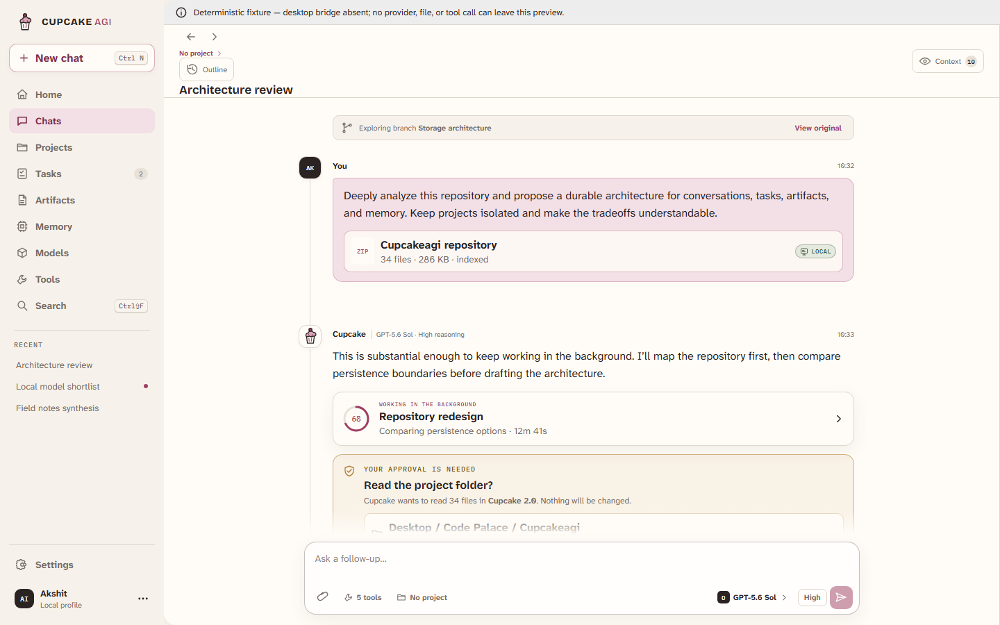

# CUPCAKEAGI 2.0


CUPCAKEAGI is a text-first, local desktop workspace for chatting with AI, giving it files and tools,
and letting substantial work continue in the background. The conversation stays at the center:
choose a model, add the context you want, see where data is going, and keep chatting while Cupcake
works.

The personality is still here. The sugar rush is not.

> **Local release-candidate work.** Version 2.0 is being assembled and tested for Windows 10/11 x64
> on the `feat/cupcakeagi-2.0` branch. It has not been published, pushed as a 2.0 release, connected
> to a production update feed, or approved for general installation. The
> [implementation checklist](docs/architecture/IMPLEMENTATION_CHECKLIST.md) is the source of truth
> for current completion.

## What 2.0 is

- **Text first.** There is no voice surface in the 2.0 release candidate.
- **Model explicit.** You choose the provider and model for a message. CUPCAKEAGI does not silently
  route requests.
- **Local by default, clear at the boundary.** Local data remains local unless a selected cloud
  model or connected tool needs it; the destination is shown before data leaves the machine.
- **One conversation, small or substantial.** A quick answer stays a chat turn. Longer work can
  become a durable task without forcing a separate mode.
- **Project aware.** Projects group chats, files, instructions, memories, tasks, artifacts, and
  permissions without leaking context into unrelated work.
- **Inspectable, not noisy.** Tool calls collapse into concise cards. Context, permissions, costs,
  task events, and redacted runtime details are available when needed.

## Release-candidate feature map

| Area               | 2.0 contract                                                                                                                                                 |
| ------------------ | ------------------------------------------------------------------------------------------------------------------------------------------------------------ |
| Chat               | Streaming Markdown, code, tables, equations, citations, message actions, and non-destructive branches                                                        |
| Models             | Direct OpenAI, Anthropic, Gemini, xAI, Mistral, Cohere, and NVIDIA NIM adapters; generic OpenAI-compatible endpoints; explicit model and reasoning selection |
| Local models       | CUPCAKEAGI-managed llama.cpp plus Ollama and LM Studio discovery/management and external vLLM connections; model weights are never bundled                   |
| Projects and files | Optional project boundaries, rich attachments, live read-only repositories, structured parsing, stable citations, and search                                 |
| Memory             | Typed and scoped memories with source, confidence, revision, expiry, disable, and delete controls                                                            |
| Tasks              | Durable background work, approvals, checkpoints, recovery, queued follow-ups, and bounded specialist subagents                                               |
| Tools              | Scoped file/repository, web, Git, Python, model, and artifact tools plus local/remote MCP and an out-of-process custom-tool SDK                              |
| Artifacts          | Documents, code, tables, images, diagrams, webpages, and reports with preview, editing, revisions, and export                                                |
| Interface          | Home, Chats, Projects, Tasks, Artifacts, Memory, Models, Tools, Search, Settings, and optional Developer Mode                                                |
| Themes             | Cupcake Light, Cupcake Dark, Minimal, and Classic, with reduced-motion and keyboard support                                                                  |
| Proactive features | Quiet Thoughts and Dreams suggestions, disabled by default                                                                                                   |

See the [user guide](docs/user-guide.md) for how these parts fit together and
[known issues](docs/known-issues.md) for the current release-candidate boundaries.

## Try it before upgrading

You do not need to begin with a large paid plan. These are the official developer offers CUPCAKEAGI
users can currently experiment with; limits, regions, and eligibility can change.

| Route             | Free-access status                                                                                                         | Good first step                                                                                                                         |
| ----------------- | -------------------------------------------------------------------------------------------------------------------------- | --------------------------------------------------------------------------------------------------------------------------------------- |
| Gemini            | Ongoing free API tier for selected models                                                                                  | Create a key in [Google AI Studio](https://aistudio.google.com/app/apikey)                                                              |
| Mistral           | Free plan currently includes $10/month in API credits                                                                      | Start in [Mistral Studio](https://console.mistral.ai/)                                                                                  |
| Cohere            | Free, rate-limited evaluation key; not for production or commercial use                                                    | Create a [trial key](https://dashboard.cohere.com/api-keys)                                                                             |
| NVIDIA NIM        | Free NVIDIA-hosted API Catalog access for individual prototyping, development, and testing; not a production entitlement   | Join the [NVIDIA Developer Program](https://developer.nvidia.com/nim) and get one key from the [API Catalog](https://build.nvidia.com/) |
| OpenAI            | A first test request or account-specific grants may be available; no published recurring free tier for current chat models | Check the [API quickstart](https://platform.openai.com/docs/quickstart) before adding credits                                           |
| Anthropic         | General API access is prepaid/pay-as-you-go; no general free tier is published                                             | Open the [Claude Console](https://console.anthropic.com/) only if you want to fund testing                                              |
| xAI               | General API access uses prepaid credits or approved invoicing; promotions are account-specific                             | Check the [xAI Console](https://console.x.ai/) for any current credit                                                                   |
| OpenAI-compatible | Groq, selected OpenRouter models, and Cloudflare Workers AI publish limited free developer access                          | Use an explicit model through CUPCAKEAGI's compatible-endpoint setup                                                                    |
| Local             | CUPCAKEAGI Local/llama.cpp, Ollama, and LM Studio have no provider API charge                                              | Download a model whose license and hardware needs fit your use                                                                          |

The detailed [free-tier guide](docs/free-tier-guide.md) has current limits, official signup links,
compatible endpoint notes, and privacy/cost cautions. It was last checked on **2026-08-29**; verify
the provider dashboard before relying on any allowance.

## Screenshot



The screenshot uses deterministic local fixtures so the interface can be reviewed without exposing
credentials, private conversations, or provider data.

## Architecture at a glance

```text
React + TypeScript renderer
          │ narrow, typed preload API
Electron main process
          │ authenticated framed messages over private pipes
          ├──────── Python runtime
          │         providers, tasks, memory, retrieval, persistence
          │
          └──────── Rust ToolBroker
                    credentials, policy, grants, MCP, sandboxing, audit
```

The renderer has no Node.js access and never receives credentials, arbitrary process APIs, or raw
filesystem paths. Product-owned, versioned contracts keep provider SDK objects and framework
checkpoints out of durable application state. Conversations and artifacts are immutable revision
graphs; SQLite FTS5 provides the search baseline; encrypted content-addressed objects hold files and
artifact revisions.

The runtime uses Pydantic AI Core for provider-neutral agent mechanics and DBOS for recoverable
work. These are implementation details behind CUPCAKEAGI contracts, not the product database or UI
protocol. The architecture is documented under [`docs/architecture`](docs/architecture/).

## Privacy and permissions

CUPCAKEAGI is a local, single-user application with no Cupcake account or cloud sync.

- Provider keys are protected per Windows user with DPAPI, not stored in project files or logs.
- Files and repositories are represented by opaque grants. Repositories are read-only until an exact
  write is approved.
- Cloud models and remote tools receive only the context required for that request, with a visible
  Local/Cloud destination.
- Generated code runs in a staged, bounded sandbox with no credentials or network by default.
- Deletion, external communication, financial actions, installation, system changes, and unsandboxed
  execution always require fresh approval.
- Developer Mode exposes redacted events and provenance, never private chain-of-thought.

Read [Privacy, destinations, and approvals](docs/user-guide.md#privacy-destinations-and-approvals)
before using a cloud provider with sensitive data.

## Run from source

The eventual supported end-user path will be a signed Windows 10/11 x64 installer. The current
private candidate is intentionally unsigned and must not be distributed. Until the owner approves
it, development runs and the local test package are the only supported ways to try 2.0. macOS,
Linux, Windows on Arm, and 32-bit Windows are not release-candidate targets.

Requirements:

- Node.js 20.19 or newer
- pnpm 10.15.1 or newer through Corepack
- Rust stable for the ToolBroker
- Python 3.12 for runtime development

From the repository root:

```powershell
corepack enable
corepack prepare pnpm@10.15.1 --activate
pnpm install --frozen-lockfile
pnpm --filter @cupcakeagi/desktop dev
```

The desktop can run against clearly labeled deterministic fixtures while cloud credentials and local
model runtimes are absent. Do not place API keys in the repository or a `.env` file. Configure
credentials only through the in-app provider setup; the packaged Rust broker protects them with
per-user Windows DPAPI before the Python runtime receives a memory-only credential lease.

For the complete toolchain, runtime setup, and packaging commands, use the
[development guide](docs/development.md). For an evidence-oriented release-candidate pass, use
[local testing](docs/local-testing.md).

## Common checks

```powershell
pnpm lint
pnpm typecheck
pnpm test
pnpm build
cargo test --manifest-path crates/tool-broker/Cargo.toml
```

`pnpm check` runs the JavaScript/TypeScript lint, type, and unit-test checks together. After
installing the documented Python and Rust toolchains, `node scripts/verify.mjs --lane all` runs
contract drift, JavaScript/TypeScript, Python, and Rust validation. Runtime setup is detailed in
[development.md](docs/development.md).

No build result is a visual acceptance test. User-interface work also requires Playwright
interaction checks, captured screenshots at the required themes and viewports, and human inspection
of those screenshots.

## Documentation

- [User guide](docs/user-guide.md)
- [Development guide](docs/development.md)
- [Local release-candidate testing](docs/local-testing.md)
- [Known issues and release boundaries](docs/known-issues.md)
- [Architecture decisions and implementation ledger](docs/architecture/)
- [Product contracts](packages/contracts/README.md)

## Roadmap

The 2.0 release-candidate gate is deliberately broad: the desktop shell, provider adapters,
local-model manager, projects/files/search, memory, artifacts, native and MCP tools, durable tasks,
Developer Mode, migration, accessibility, security verification, and native packaging must work
together before approval.

After that gate, likely work includes production signing and update infrastructure, more MCP
connection recipes, additional Windows acceleration packs, and optional secondary capabilities.
macOS/Linux parity, voice, and automatic model routing are not part of the 2.0 contract.

## From the original CUPCAKEAGI


CUPCAKEAGI began in 2023 as an experimental multisensory assistant built around GPT-3.5, a Next.js
frontend, a Python/FastAPI backend, persistent flat-file state, scheduled tasks, modular
“Abilities,” emotions, random thoughts, dreams, and a very enthusiastic rainbow cupcake mascot.

2.0 keeps the ideas that made the project distinctive—memory, tools, background work, proactive
reflection, personality, and the mascot—while replacing the architecture and presentation.
“Abilities” become permissioned native and MCP tools. Talk and Task become one continuous chat that
can promote substantial work into a durable task. Thoughts and Dreams become quiet, opt-in memory
suggestions. The original glossy mascot remains in About and the Classic theme; the everyday
interface uses the calmer CUPCAKEAGI 2.0 mark.

The original source remains recoverable in Git history and at the `v1.0.0` tag. Legacy data is
imported once through a constrained importer; old API keys are never imported. The project remains
licensed under the [Unlicense](LICENSE).

## Release policy

Do not publish packages, push a 2.0 release, create a GitHub release, enable a production updater,
or distribute an installer from this branch before explicit owner approval. A locally packaged
application is a test artifact, not a release.
